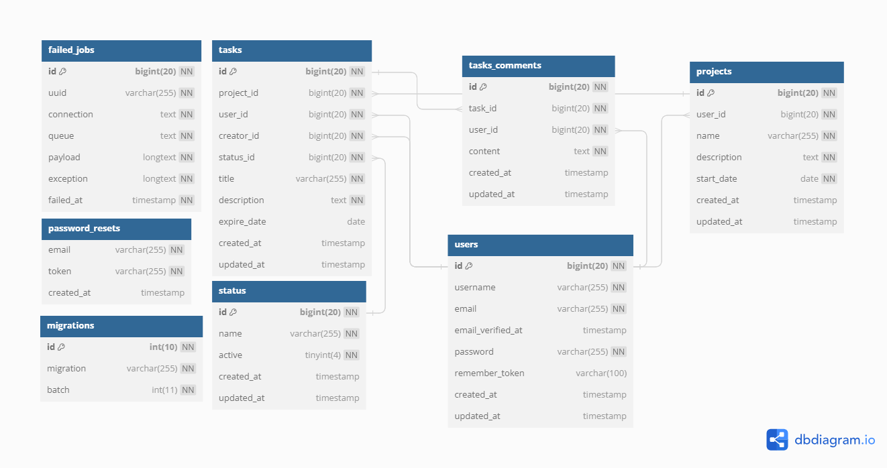

<p align="center"></p>

## Requirements
- PHP >= 7.1.3
- BCMath PHP Extension
- Ctype PHP Extension
- JSON PHP Extension
- Mbstring PHP Extension
- OpenSSL PHP Extension
- PDO PHP Extension
- Tokenizer PHP Extension
- XML PHP Extension

Review more info in official documentation in https://laravel.com/docs/5.8/installation

## Installation

Run:

```cmd
composer install
cp .env.example .env
php artisan key:generate
```

Configure vars in .env: database connection, email, etc..

Run
```cmd
php artisan migrate
php artisan db:seed
php artisan serve
```

## About Project

This is a Laravel a web application framework for manager projects users and tasks with option of add comments to tasks.

## Entity Relationship Model - MER
<p align="center"></p>

## Data Dictionary
**Table: failed_jobs**

Description: Table to store failed jobs in the system.
|Field name|Datatype|Key type|Comment|
| :-------------- | :------------- | :-------------------------- | :--------- |
|id	|bigint(20)	|PRIMARY KEY (id)	|Identificador único autoincremental|
|uuid	|varchar(255)|		|Identificador único universal|
|connection	|text|		|Tipo de conexión|
|queue	|text|		|Cola de trabajo|
|payload	|longtext|		|Datos del trabajo|
|exception	|longtext|		|Información de la excepción|
|failed_at	|timestamp|		|Fecha y hora de fallo|

**Table: migrations**

Description: Table to store the migration log in the database.
|Field name|Datatype|Key type|Comment|
| :-------------- | :------------- | :-------------------------- | :--------- |
|id	|int(10) unsigned	|PRIMARY KEY (id)	|Identificador único autoincremental
|migration	|varchar(255)|		|Nombre de la migración
|batch|	int(11)|		|Lote de migración

**Table: password_resets**

Description: Table to store password reset tokens.
|Field name|Datatype|Key type|Comment|
| :-------------- | :------------- | :-------------------------- | :--------- |
|email	|varchar(255)|		|Correo electrónico
|token	|varchar(255)|		|Token de restablecimiento
|created_at	|timestamp|		|Fecha de creación

**Table: projects**

Description: Table to store project information.
|Field name|Datatype|Key type|Comment|
| :-------------- | :------------- | :-------------------------- | :--------- |
|id	|bigint(20) unsigned|	PRIMARY KEY (id)	|Identificador único autoincremental
|user_id	|bigint(20) unsigned	|INDEX (projects_user_id_foreign)	|ID del usuario creador
|name	|varchar(255)|		|Nombre del proyecto
|description	|text|		|Descripción del proyecto
|start_date|	date|		|Fecha de inicio del proyecto
|created_at	|timestamp|		|Fecha de creación
|updated_at	|timestamp|		|Fecha de última actualización

**Table: status**

Description: Table to store states in which tasks can be.
|Field name|Datatype|Key type|Comment|
| :-------------- | :------------- | :-------------------------- | :--------- |
|id	|bigint(20) unsigned	|PRIMARY KEY (id)	|Identificador único autoincremental
|name	|varchar(255)|		|Nombre del estado
|active	|tinyint(4)|		|Indicador de estado
|created_at	|timestamp|		|Fecha de creación
|updated_at	|timestamp|		|Fecha de última actualización

**Table: tasks**

Description: Table to store tasks related to projects.
|Field name|Datatype|Key type|Comment|
| :-------------- | :------------- | :-------------------------- | :--------- |
|id	|bigint(20) unsigned	|PRIMARY KEY (id)	|Identificador único autoincremental
|project_id	|bigint(20) unsigned	|INDEX (tasks_project_id_foreign)	|ID del proyecto padre
|user_id	|bigint(20) unsigned	|INDEX (tasks_user_id_foreign)	|ID del usuario asignado
|creator_id	|bigint(20) unsigned	|INDEX (tasks_creator_id_foreign)	|ID del usuario creador
|status_id	|bigint(20) unsigned	|INDEX (tasks_status_id_foreign)	|ID del estado
|title	|varchar(255)|		|Título de la tarea
|description	|text|		|Descripción de la tarea
|expire_date	|date|		|Fecha de vencimiento opcional
|created_at	|timestamp|		|Fecha de creación
|updated_at	|timestamp|		|Fecha de última actualización

**Table: tasks_comments**

Description: Table to store comments related to tasks.
|Field name|Datatype|Key type|Comment|
| :-------------- | :------------- | :-------------------------- | :--------- |
|id	|bigint(20) unsigned	|PRIMARY KEY (id)	|Identificador único autoincremental
|task_id	|bigint(20) unsigned	|INDEX (tasks_comments_task_id_foreign)	|ID de la tarea padre
|user_id	|bigint(20) unsigned	|INDEX (tasks_comments_user_id_foreign)	|ID del usuario creador
|content	|text|		|Contenido del comentario
|created_at	|timestamp|		|Fecha de creación
|updated_at	|timestamp|		|Fecha de última actualización

**Table: users**

Description: Table to store user information.
|Field name|Datatype|Key type|Comment|
| :-------------- | :------------- | :-------------------------- | :--------- |
|id	|bigint(20) unsigned	|PRIMARY KEY (id)	|Identificador único autoincremental
|username	|varchar(255)	|UNIQUE (users_username_unique)	|Nombre de usuario único
|email	|varchar(255)	|UNIQUE (users_email_unique)	|Correo electrónico único
|email_verified_at	|timestamp|		|Fecha de verificación de correo electrónico
|password	|varchar(255)|		|Contraseña del usuario
|remember_token	|varchar(100)|		|Token de recordatorio de sesión
|created_at	|timestamp|		|Fecha de creación
|updated_at	|timestamp|		|Fecha de última actualización

## Copyright

[Jorge Ivan Carrillo Gonzalez](https://www.linkedin.con/in/jorgecarrillog)

## License

The Laravel framework is open-source software licensed under the [MIT license](https://opensource.org/licenses/MIT).
